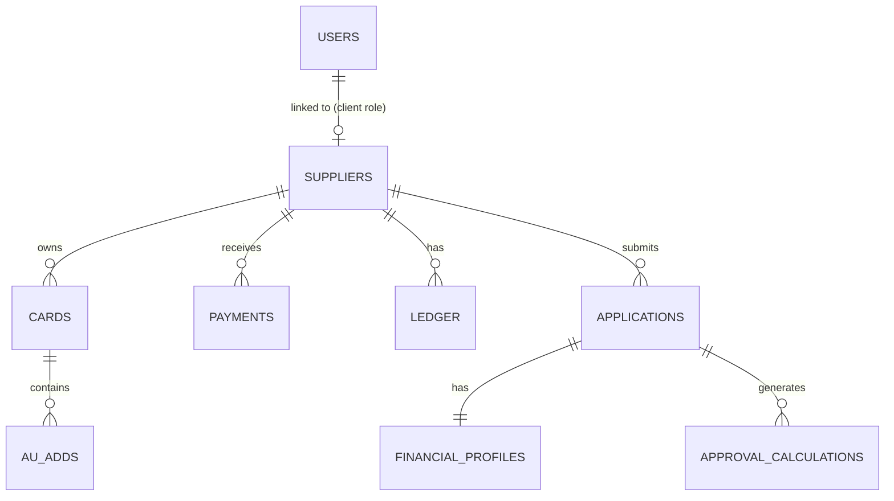

# Clearline — Supplier CRM & Financial Approval Engine

A full-stack CRM built in Laravel that replaced two manual operational spreadsheets (a supplier/tradeline tracker and a standalone loan-approval calculator) with a single, role-based web application. Built end-to-end in 7 days as a self-directed challenge: requirements analysis, schema design, business-logic implementation, and UI, all done solo.

**[Live Demo](https://crm-mvp-production-26f1.up.railway.app/) · [Screenshots](#screenshots)**

---

## Why this project is relevant

This build maps closely onto the core of CRM development work:

- **Translating business requirements into a technical solution** — the entire schema and business ruleset was reverse-engineered from real spreadsheets (including a documented 20-rule SOP and a multi-tab operational workbook), not built from a clean spec. That's the same skill required to turn a stakeholder's messy process into a working system.
- **Client / lead / contact management** — the Supplier CRM here is structurally identical to client management: profiles, tiered status, related records (cards → the equivalent of contracts/assets), and full activity history.
- **Task and activity tracking** — the "3 jobs to clear" system on the client-facing dashboard is a live, computed task list, not a static to-do — it's generated from real database state (unverified records, unconfirmed payments, etc.).
- **Dashboards and reporting** — both a staff-facing operational dashboard and a client-facing portal dashboard, each pulling live aggregates (not hardcoded numbers).
- **User accounts, roles, and permissions** — full role-based access control (staff vs. client), enforced at the route/middleware level, with each role seeing a completely different set of screens from the same codebase.
- **A calculation engine that has to be right** — the financial approval engine reproduces real underwriting math (revenue, profit, and deposit-based loan sizing across multiple lending products) and was verified line-by-line against the source spreadsheet's own worked examples before being trusted in the app.

---

## Feature overview

### Staff-side CRM
- Supplier (client) management — full CRUD, tiered status (Preferred / Standard / Under Review)
- Nested asset management (Cards → Spots), each with its own verification and payout state
- Payment recording and confirmation workflow
- Ledger for two-way balance tracking (amounts owed each direction)
- Financial applications with a persisted calculation history (every run is saved, not just the latest result)

### Client-facing portal
- Personalized dashboard: live count of outstanding tasks, money due, posting-rate tier — computed from the same data staff manage, not a separate copy
- Read-only detail views (My Spots, My Cards, My Payments, Our Account) matching the exact operational columns clients need
- Zero access to other clients' data — enforced by ownership checks, not just UI hiding

### Financial Approval Engine
- Pure PHP service class reproducing a real underwriting model: revenue / profit / deposits → sized approval amounts across 4 lending lanes (bank/fintech × term loan/line of credit)
- All 12 sizing parameters (multipliers, floors, caps) live in an admin-editable settings table — no hardcoded business rules
- Every calculation persists a full audit trail: which metric governed the result, what flags applied (capped, sub-floor, etc.)

### Design
- Custom design system (not a UI kit): icon-rail navigation, dark-glass content cards, bento-grid dashboards
- Data visualized where it matters — live SVG sparkline on the staff dashboard, circular progress indicator for posting rate — built from real query results, not static images

---

## Tech stack and rationale

| Layer | Choice | Why |
|---|---|---|
| Backend | Laravel 12 (PHP) | Mature ecosystem for exactly this shape of problem — auth, RBAC, Eloquent ORM, migrations — without reinventing infrastructure |
| Database | MySQL | Relational integrity matters here (foreign keys, cascading deletes, unique constraints) — this data is inherently relational, not document-shaped |
| Frontend | Blade + Tailwind CSS + Alpine.js | No SPA framework needed for a CRUD-heavy CRM; server-rendered views with light interactivity keep the codebase simple and fast to iterate on |
| Auth | Laravel Breeze, extended with custom role middleware | Standard, auditable auth foundation rather than a custom-rolled system |

For a client project I'd make this decision based on their actual needs — e.g. if heavy real-time collaboration or a mobile app were required, I'd bring in Inertia/Vue or a separate API + SPA frontend instead.

---

## Architecture



- Role-based route groups (`role:staff`, `role:supplier`) enforced via custom middleware
- Nested resource controllers mirroring the real object hierarchy (a Spot only exists within a Card, which only exists within a Supplier)
- A dedicated `ApprovalEngine` service class, fully decoupled from HTTP/controller concerns — testable in isolation

---

## Screenshots

*(Add screenshots or a short screen-recording GIF here — staff dashboard, client dashboard, and the approval engine results view are the strongest three to lead with.)*

---

## Running it locally

```bash
composer install
npm install && npm run build
cp .env.example .env
php artisan key:generate
# Configure DB credentials in .env
php artisan migrate --seed
php artisan serve
```

---

## What I'd do differently on a client engagement

- Lock the data model against a written spec before writing any UI — mid-build schema changes here (adding entities discovered from a second reference document) were the most expensive rework of the whole project.
- Add automated tests around the calculation engine specifically — it was manually verified against source data, but a client-facing financial calculator should have regression tests from day one.
- Build the admin settings UI for business-rule parameters earlier, rather than leaving direct database edits as the only way to tune them.

---

## About this build

Built solo in 7 days, from spreadsheet analysis through deployment. Happy to walk through any part of the codebase, the schema decisions, or the approval-engine verification process in more detail.
